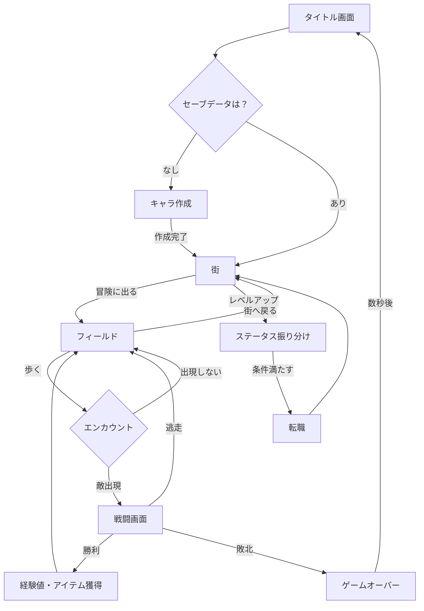

はい、承知いたしました。ご指定の要件定義書をマークダウン形式で整形します。

---

# RPG 研修課題 - MVP 要件定義書

## 1\. プロジェクト概要

### 1.1. ゲームタイトル（仮）

『Rogue RPG』

### 1.2. コンセプト

風来のシレンのような探索要素と、チョコットランドのようなキャラクター育成の楽しさを組み合わせた、コマンドバトル RPG。

### 1.3. MVP（Minimum Viable Product）のゴール

研修課題の必須要件をすべて満たし、ゲームのコアサイクル（街 → 冒険 → 戦闘 → 成長 → 街）を体験できる状態を完成形とする。

## 2\. ゲームのコアサイクル

ゲームの基本的な流れは以下の通りです。

## 3\. 機能要件（MVP スコープ）

### 3.1. 画面一覧と機能

- **タイトル画面**

  - ゲームタイトルの表示
  - 「スタート」「コンティニュー」ボタン
  - 初回は「スタート」のみ
  - 「コンティニュー」でセーブデータをロードし「街」から再開

- **キャラクター作成画面**

  - 「スタート」選択後に遷移
  - プレイヤー名の入力
  - 初期職業は「無職」で固定
  - 「決定」ボタンで「街」画面へ

- **街画面 (拠点)**

  - 各種 UI（ステータス、メッセージ）の表示
  - 機能 NPC（話しかけると機能するキャラクター）
    - **冒険への案内人**: 「はい」でフィールド画面へ遷移
    - **転職神官**: 転職条件を満たしているか判定し、転職を実行
    - **記録係**: ゲームデータのセーブ

- **フィールド画面**

  - 背景、プレイヤー、移動ボタンの表示
  - 1 歩ごとにエンカウント判定
  - 歩数に応じて背景を切り替え（平地 → 森 → 沼）
  - フィールドごとにエンカウント率を変更

- **戦闘画面**

  - 敵、メッセージ、コマンドエリアの表示
  - コマンド：「たたかう」「にげる」
  - 戦闘は 1 対 1 のターン制コマンドバトル
  - 勝敗はパラメータに応じた確率で決定
  - 勝利で経験値獲得、敗北でゲームオーバー（タイトルへ）

### 3.2. コアシステム

#### ① キャラクターシステム

- **ステータス**:
  - **HP**: 体力
  - **STR**: 物理攻撃力（たたかうの勝率に影響）
  - **VIT**: 防御力（被ダメージ軽減、HP の伸びに影響）
  - **INT**: 魔法攻撃力・回復力（将来的な魔法職に影響）
  - **AGI**: 素早さ（逃走成功率、将来的な命中・回避に影響）
- **初期状態**: 全員「無職 Lv.1」でスタート。

#### ② レベルアップとステータス振り分け

- 敵を倒すと経験値（EXP）が溜まる。
- 一定の EXP でレベルアップ。
- レベルアップ時に「ステータスポイント」を 3 獲得。
- 街でプレイヤーが任意のステータスにポイントを割り振れる。

#### ③ 転職システム

- 街の「転職神官」に話しかけることで転職が可能。
- **転職条件**: 特定のステータスが一定値に達していること。
- **転職先と条件（例）**:
  - **戦士 (Warrior)**
    - **条件**: STR が 10 以上
    - **特徴**: STR の成長率が高い。
  - **魔法使い (Wizard)**
    - **条件**: INT が 10 以上
    - **特徴**: INT の成長率が高い。
  - **シーフ (Thief)**
    - **条件**: AGI が 10 以上
    - **特徴**: AGI の成長率が高い。逃走確率にボーナス。
  - **プリースト (Priest)**
    - **条件**: INT が 5 以上, VIT が 5 以上
    - **特徴**: VIT の成長率が高い。

#### ④ 戦闘ロジック（課題要件準拠）

- **たたかう**: `(プレイヤーのSTR / 敵のVIT) * 乱数` のような計算式でダメージを算出し、勝敗を決定。
- **にげる**: プレイヤーの AGI に応じた確率で成功。失敗した場合は敵の攻撃を受ける。

#### ⑤ データセーブ

- 街の「記録係」に話しかけることで、現在の状態をブラウザの`localStorage`に保存する。

## 4\. 必須技術要件（研修課題）

- `const` を基本とし、再代入が必要な変数のみ `let` を使用する。
- 関数はアロー関数 (`=>`) で定義する。
- `class`構文を用いてオブジェクト（Player, Job, Enemy 等）を設計する。
- `extends` を使用し、職業クラス (Warrior 等) を基底クラス (Job) から継承する。
- 文字列の連結にはテンプレートリテラル ( `` `${}` `` ) を使用する。
- 上記システムをオブジェクト指向の考え方で実装する。
- フィールド画面ではリロード(F5)とブラウザバックを無効化する。

## 5\. MVP 以降の拡張案

- 戦闘システムのチョコットランド風アクション化
- 2 次職、3 次職の実装
- スキル・魔法の実装
- 装備品、アイテムの実装
- マップ、シナリオの追加
